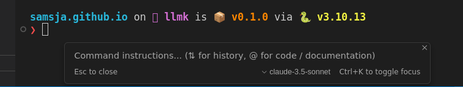

# Local alternative to cursor ctrl k 

I have been using cursor for a while now, it's a great product wiht a lot of functionality.


I am a heavy terminal user but I have a bad memory for terminal command, I think some command line argument of tool like `scp`, `tar` or `docker`  are just unlearnable for sane human. Hopefully llm are good at memorizing stuff. One of my favorite cursor features is to be able to prompt model to interact direclty with the terminal. This is done by pressing ctrl-k in the terminal, write a query and execute the proposed command. 



This works great most of the time, and when it does not it usually mean that I will need to have a multi turn chat session with the model to make it understand what I want. 

But its has several flaws imo:

* It slow, it takes multiple seconds to get the command, mainly because it is using big model behind an api
* It only work inside cursor integrated terminal, but I fallback to use [allacritty](https://github.com/alacritty/alacritty) terminal each time I am outside of a coding enviroment.


So I figure out that both problem would be fixed if I could just call a small model from within my terminal. 

One can argue than even though small model are faster to run locally their ratio latency/smartness is really bad compare to calling an api. 

Well this is true for most usecase, but I would argue that remenbering terminal command and argument is not that hard for a model. 

So let's try to setup [Qwen coder2.5 0.5b](https://huggingface.co/Qwen/Qwen2.5-Coder-1.5B-Instruct-GGUF) locally and use it from the terminal :)

I am gonna use the [llm](https://github.com/simonw/llm) cli which makes everything super easy. Yeah this blog post is just a wrapper around [llm](https://github.com/simonw/llm) documentation.

Before I show you how to install it, lets look at how the end usage look like


Pretty nice, short, work in any terminal, and it is fast. 


PS: I am using qwen 0.5b but one could you any llama.cpp model as well as OpenAI or claude model


## Installation


First you need to install [llm](https://github.com/simonw/llm)


I recommand using [uv](https://github.com/astral-sh/uv) as it is the fastest way to install cli tool and manage python.

if you don't have uv installed, you can install it with 

```bash
curl -LsSf https://astral.sh/uv/install.sh | sh
```

then do

```bash
uv tool install llm
```

If you prefer to use pip (not good :( ) feel free to use 

```bash
pip install llm
```

Once llm is install you need to install the gguf plugin which is a wrapper around llama.cpp.


```bash
llm install llm-gguf
```


Let's now download the whole qwen family. (Feel free to only download 0.5b if you just want to tests)

```bash

```
llm gguf download-model https://huggingface.co/Qwen/Qwen2.5-Coder-0.5B-Instruct-GGUF/resolve/main/qwen2.5-coder-0.5b-instruct-fp16.gguf --alias qwen-coder-2.5-0.5b --alias qw0.5
```

```
llm gguf download-model https://huggingface.co/Qwen/Qwen2.5-Coder-1.5B-Instruct-GGUF/resolve/main/qwen2.5-coder-1.5b-instruct-q8_0.gguf --alias qwen-coder-2.5-1.5b --alias qw1.5b
```

```
llm gguf download-model https://huggingface.co/Qwen/Qwen2.5-Coder-3B-Instruct-GGUF/resolve/main/qwen2.5-coder-3b-instruct-q8_0.gguf --alias qwen-coder-2.5-3b --alias qw3b
```

```
llm gguf download-model https://huggingface.co/Qwen/Qwen2.5-Coder-7B-Instruct-GGUF/resolve/main/qwen2.5-coder-7b-instruct-q8_0.gguf --alias qwen-coder-2.5-7b --alias qw7b
```

To test that the models are properly downloaded you can do

```
llm -m qw0.5 "hello"
```

you can list model as well using 

```
llm models

llm models
OpenAI Chat: gpt-4o (aliases: 4o)
OpenAI Chat: gpt-4o-mini (aliases: 4o-mini)
OpenAI Chat: gpt-4o-audio-preview
OpenAI Chat: gpt-4o-audio-preview-2024-12-17
OpenAI Chat: gpt-4o-audio-preview-2024-10-01
OpenAI Chat: gpt-4o-mini-audio-preview
OpenAI Chat: gpt-4o-mini-audio-preview-2024-12-17
OpenAI Chat: gpt-3.5-turbo (aliases: 3.5, chatgpt)
OpenAI Chat: gpt-3.5-turbo-16k (aliases: chatgpt-16k, 3.5-16k)
OpenAI Chat: gpt-4 (aliases: 4, gpt4)
OpenAI Chat: gpt-4-32k (aliases: 4-32k)
OpenAI Chat: gpt-4-1106-preview
OpenAI Chat: gpt-4-0125-preview
OpenAI Chat: gpt-4-turbo-2024-04-09
OpenAI Chat: gpt-4-turbo (aliases: gpt-4-turbo-preview, 4-turbo, 4t)
OpenAI Chat: o1
OpenAI Chat: o1-2024-12-17
OpenAI Chat: o1-preview
OpenAI Chat: o1-mini
OpenAI Chat: o3-mini
OpenAI Completion: gpt-3.5-turbo-instruct (aliases: 3.5-instruct, chatgpt-instruct)
GgufChatModel: gguf/qwen2.5-coder-0.5b-instruct-fp16 (aliases: qwen-coder-2.5-0.5b, qw0.5)
GgufChatModel: gguf/qwen2.5-coder-1.5b-instruct-fp16 (aliases: qwen-coder-2.5-1.5b, qw1.5b)
GgufChatModel: gguf/qwen2.5-coder-1.5b-instruct-q8_0 (aliases: qwen-coder-2.5-1.5b, qw1.5b)
GgufChatModel: gguf/qwen2.5-coder-3b-instruct-q8_0 (aliases: qwen-coder-2.5-3b, qw3b)
GgufChatModel: gguf/qwen2.5-coder-7b-instruct-q8_0 (aliases: qwen-coder-2.5-7b, qw7b)
Default: gguf/qwen2.5-coder-3b-instruct-q8_0
```

Let's now setup the template cmd with a system prompt.

For linux (ubuntu) user

```
llm --system 'reply with ubuntu terminal commands only, no extra information' --model qw0.5 --save cmd
```

for mac


```
llm --system 'reply with ubuntu terminal commands only, no extra information' --model qw0.5 --save cmd
```

At this stage you should be able to do

```
>>> llm -t cmd "git clone torch"
git clone https://github.com/pytorch/pytorch.git
```

but I prefer to have even a shorter alias as I want this to be quick to type


Last step is to add into your .bashrc or .zshrc (or whatever you use)

```
alias llmk='f() { llm -t cmd "\"$*\""; }; f'
```


Finally you can try

> llmk git clone torch
> ```bash
> git clone https://github.com/pytorch/torch.git
> ```


the end.