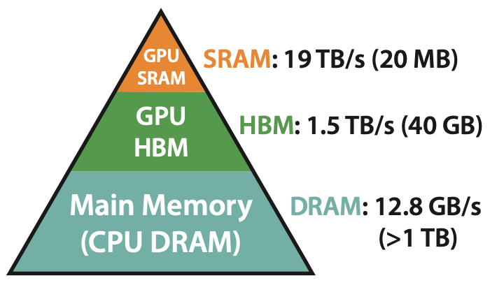

# Weight sharing is the inverse of MoE.  

**22 june, 2024**

MoE/sparse model are less dense than traditional architecture where density is define as the ratio of total active parameter divided by the number of parameters. What is usually called "dense model" have a density of 1.0 .  
  
MoE usually reduce their density by routing tokens to different circuits within the model, increasing the total amount of trainable parameter while keeping the amount of active one constant.  
  

### Different level of density 


MoE are less dense model, what would be a more dense model (with density >1) ?  

It's a model where the weight are shared. For instance a model where a transformer block would be repeated. Each parameter would be used several times, making them more active that in a traditional "dense" model.  
  
I put dense into bracket here because it is actually abusing the word, there is no such thing as a dense and non dense model, just different density flavor .  
  
Why does it matter ? **Because introducing density as a scale allow to consider a whole new class of model architecture**.  
  
We need to move away from the idea that number of parameters should scale at the same path as the amount of flops we allow a model to consume.  There should be two axis to bigger model, more activation sand more weights (more flops and more VRAM)

## Disentangle storage and computation 

Conceptually it actually makes sense to disentangle the storage(weights) from the computation (activation). The former dictates how much data can be compressed, the later control the complexity of the algorithms that can be learn by ruling the amount of flops that can be spend at each forward.  
  
Of course in practice things are more complex, knowledge/fact and reasoning ability / algorithm are two faces of the same coins.  However it can be handy to **visualize all of the function learn by an LLM in a range between *purely retrieval* and *purely algorithmic*.** It would actually makes sense that the former leverage more weight while the later leverage more depth or more flops per forward.  
  
Let's take an example, for a model with an almost infinite storage capacity the easiest way to achieve low perplexity over, let's say a math textbook distribution, is to learn everything by heart. On the other hand a model with limited storage but infinite flops at runtime will have to learn to predict everything from first principles.
  
**Having this two asymptotes in mind help reason about the usefulness of different density of model**.  
  
It is a know fact that small LLM (sorry for the oxymore) have a hard time followings instructions. Many concluded that it is because of its too small amount of weight - it's missing a neurons or two -  lol I am funny. What if the real problem was just the the forward pass was to much compute limited to be actually able to do anything "smart" ?  


### MoE  are shape by hardware constraint 
  
Okay enough for the "theoretical" thinking MoE have emerged because of hardware constraints. They are simply cheaper to train and cheaper to do inference, *on our available hardware*. 

Sparse model have comparable capability as "dense" at equal weight size, but with an order of magnitude less active parameters, and therefore less time and less cost to do inference and training. 

let's briefly take a look at t the  [Mixtral 8x7b](https://mistral.ai/news/mixtral-of-experts/) architecture to understand how hardware constraint shaped its design. (feel free to skip direclty to the conclusion)

Let's take a look a to understand how it is hardware and cost that shape the design of MoE more than any other factor. Despite it's name suggesting 8x7b = 56b parameters the model is actually a 46.7B parameters one with only 12.9B active one. Only the feed forward layer of the transformer block are sparsified. Basically instead of having one feedforward per transformer, they are 8 of them and each token will be directed to 2 feedforward. Why 8 feedforward and not 10 or 6 ? Simply because H100 nodes usually come with 8 gpus. Each of the gpu actually holds the equivalent of a 7b model (thus the naming of 8x7b) but with each of them using a different feedforward. 

Funny how this 8x7b magically fits into one node of 8x(H100 - 80gig) trained with optimizer and gradient shardings. Well you would have guess this is not a coincidence. 

tldr; MoE design are shaped by hardware constraint, they are cheaper to train than dense model only because some MoE architecture work nicely with high bandwith inter and intra connect.


### Super dense model, any usecase ?

  
Okay that was for the hardware constraint that led to the popularization of MoE. So what about super dense model, a.k.a weight shared model? Is there some hardware constraint that would make them relevant?  
  
Yes, local inference ( from laptop to mobile). Basically in local inference you work most of the time with batch size 1. Indeed contrary to model behind API that face a constant flow of thousands of users, locally there is only you using your model. Unfortunately this is totally [inefficient for GPU like chip](https://timdettmers.com/), and you end up being memory bandwidth bottleneck most of the time. It is like having to move a pile of book from the library to your table, only to respond to one question of an exam. You would spend most of your time moving book away.

That means that your compute is barely used it is always waiting for the next weights to be loaded from ram/vram to local memory (sram).

{: style="height:60%;width:60%"}

GPU being idle means that you have room to do more operation for the same cost/time as long as you can reuse the loaded weight while waiting for the next batch of weight to be loaded. Meta actually published a paper about this, [MobileLLM](https://arxiv.org/abs/2402.14905). 

Nice explanation from the paper 

```
The SRAM for computing is typically limited to around 20MB. 
This capacity is usually only sufficient to hold a  single 
transformer block. Therefore, placing shared weights in the
cache and computing twice immediately can avoid the need to 
transfer weights between the SRAM and DRAM, resulting in improved 
overall execution speed for auto-regressive inference
```
  

Immediate weight sharing between two blocks can basically double the amount of active parameters while keeping inference time the same. 


### Conclusion:  
* MoE are used for an economical reason, driven by hardware constraint
* Let's stop talking about dense and not dense mode, density is rather a scale. Different hardware constraint would lead the different density need
* Super dense model with shared weight (and reason token?) could help create very good small model that would still fit in ram/vram but rival with bigger model size in term of performance
* When a 4x1b or 4x8b with some block repeated 4 times for edge ?
  

