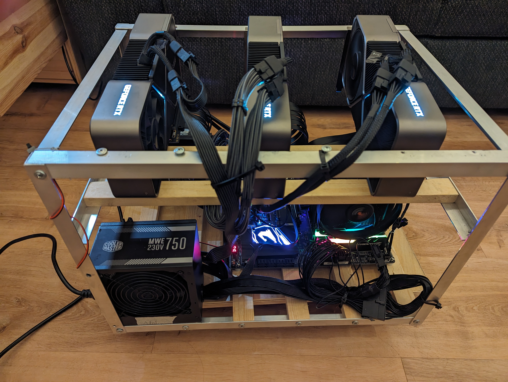
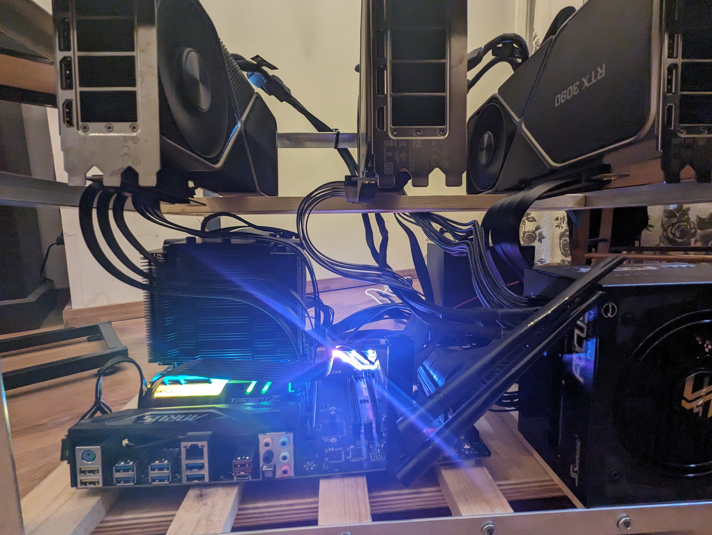
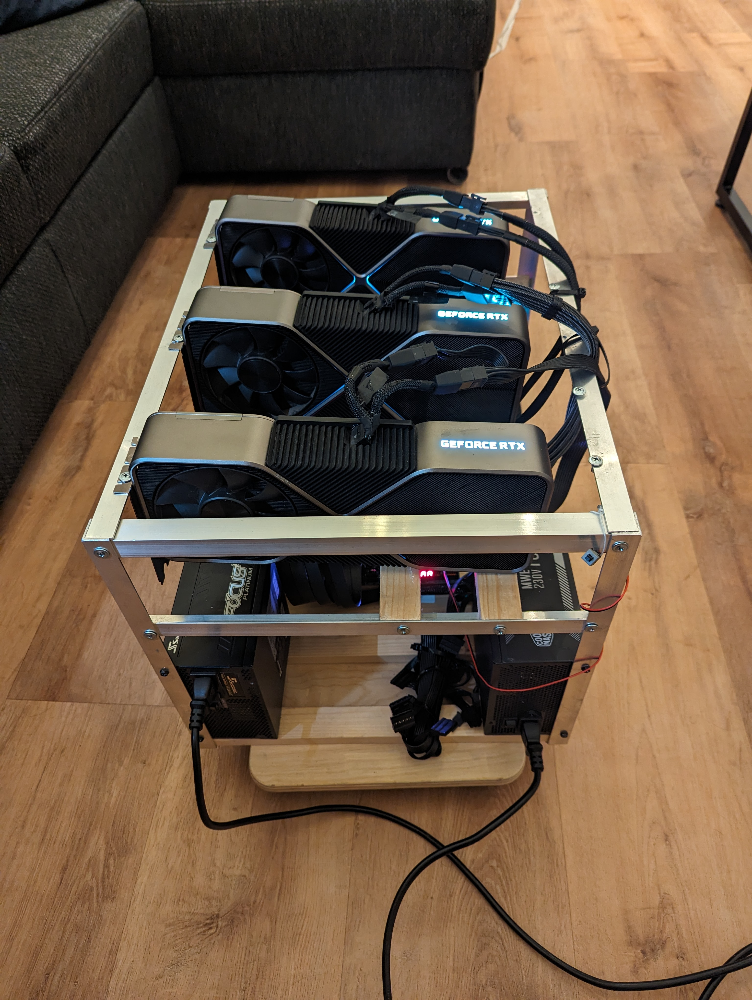

# Building a deep learning rig | part-2

**22 february, 2024**

This blog post is a follow up of [Building a deep learning rig | part-1](part_1.md) where I got my hands on a mining ring with three 3090 for 1.7k euros.

To sum up, I need to find a way to connect to 3 gpu with a okay bandwidth for doing some training. I was hesitating between two follow up option.

* Keep the mobo that came with the first machine, buy a 16 to 4x4 pcie bifurcator and live with slow inter gpu bandwidth, or
* Upgrading the mobo and the cpu to support more PCI lines

I end up choosing the second option, mainly because the price difference was not that hughes

## **Threadripper for the win**

Threadripper have 48 pcie lines (Epyc cpu have 100+) which is enough for 4 gpu as well as nvme ssd and other card. They are not too expensive in second hand, especially first and second generation, so it was the obvious decision.

I think that I have been very lucky for a second time, I got a quite good cheap combo of mobo and cpu.

I bought second hand from the same guy:

* Threadripper 1920x (first gen) with be quiet cpu fan
* x399 aorus pro mobo with 5 pcie 16 lanes
* 750W platinum seasonic focus+ modular PSU
* 32gb = 4 x 8gb of GSkill DDR4-3200 ram

and this for 425 euros (including shipping). I got a bit scared to buy it second hand with delivery but I received everything well packed without any damage.

On top of this I had to buy new:

* [Crucial P3 Plus 2TB M.2 PCIe Gen4 NVMe](https://www.amazon.de/-/en/dp/B0BYW8FLKN?psc=1&ref=ppx_yo2ov_dt_b_product_details) 119 euros 
* 3 x [pci 16 extender 30 cm](https://www.amazon.de/dp/B0C415J7JG?psc=1&ref=ppx_yo2ov_dt_b_product_details) 75 euros
* 2 x [pcie cable for the seasonic PSU](https://www.amazon.de/dp/B0CQK6RT86?psc=1&ref=ppx_yo2ov_dt_b_product_details) 30 euros
* [Intel ax210 wifi pci card](https://www.amazon.de/dp/B0BZYSY2HL?psc=1&ref=ppx_yo2ov_dt_b_product_details) 30 euros

total price: 1.7000 (original piece) + 425 (threadripper combo) + 254 (rest) = 2379.

I remember that two years ago my old company bought a similar setup for 20k, I am very happy for the price.

## **Assembling**

I first start to check that the combo CPU + mobo was working. I plugged one gpu directly connected to the mobo (no extender) without any frame to check that everything was okay, I installed the os and move on to the next step.

Then I start to assemble the rig part by part. I replaced the second 750w psu with the platinum one

For the pcie extender, 30 cm is nice for the two gpu at the extreme position, but it is a bit long for the one in the middle, 20cm would have been enough for the middle. Having one 180 degree extender could have been useful, I had to turn one quite hard to make it fit.

I make sure to attached every wire to the frame with some zipper, the modular PSU helped a lot in reducing the amount of cable. I bought as well a small skateboard (at a DIY store) so that I can move the device when it is not used.

## **Installing software**

I am a happy arch linux user, but here I was looking for stability, and since I don't need the fancy up to date package from the aur repo nor my usual i3 setup, I went with installing ubuntu 22.04 server without UI. 

I still had to plug a screen and keyboard to install, but after I set up the wifi I did not need it anymore.

I installed my usual python dependency, clone my llm training repo, start a first training on 3 gpus

and, ... , it did not work ...

The training keep hanging forever after the three process got initialized 

## **Debugging** 

The peer 2 peer communication was not working. Using [`NCCL_P2P_DISABLE`](https://docs.nvidia.com/deeplearning/nccl/user-guide/docs/env.html) allowed the training to start but with terrible performance ... the inter gpu bandwidth without p2p is punitively slow, even for DDP.

Turns out this is a pretty common problem cause by AMD virtualization options. Following the solution of [github issue](https://github.com/pytorch/pytorch/issues/52142) I disabled  `IOMMU` in the bios as well as add `iommu=pt` in kernel parameters in grub.

and, ..., it did not work, ...

I start to get scared, especially after [reading](https://discuss.pytorch.org/t/ddp-training-on-rtx-4090-ada-cu118/168366/22) that P2P was just not compatible with 4090. Isn't crazy that this is not more widespread ? I still cannot understand what people do with 4090 if you cannot communicate between them, maybe just inference ?

Anyway, I was about to flash my bios, but I saw that [comment](https://forums.developer.nvidia.com/t/rtx-3090-nvlink-cuda-p2p-not-working-on-linux-or-windows-in-different-ways/232673/9) that made it work with nvidia driver 530, and I was running 545 which was only two month old. 

So I downgraded to 535,

and, ..., it worked !!

I won't lie I got very scared, but now performance for DDP training 3 time faster that one gpu, meaning that they are just no overhead
to use 3 GPU in this setting.

## **Sound and watt limit**

I limit the power of my cards to 285w (instead of 350w), it apparently is negligible on performance (couple of percentage slower) but it is significantly better (heard it [hear](https://nonint.com/2022/05/30/my-deep-learning-rig/)). One argument is that I take less risk with the 750W psu. I should have almost 180W of margin. Tho it might not be enough, 3090 are known to create power spike to 600w, so if both of them do it at the same time it got problematic. I am waiting for it to happened before changing my psu.

The setup with the power cap is surprisingly not to loud, even at full speed for several hours. I can easily stay next to the machine and work without being distributed. 

When the machine is idle, the GPU fan are not turning nor the one from the plat PSU. So again very silent.

Open air do help a lot with temperature, at full loads the temperature of the GPU did not go over 70 degrees and 104 for the vram temp  (used this [tool](https://github.com/olealgoritme/gd) for measure). Since the GPU blow air on the right side, the GPU at the very right is the hotter. 104 for the vram is still okay, in the sense that it does not throttle performance (will start at 110). Tho ideally I would repast the thermal of the card, it apparently could get 10 degree less on the founder edition.

## **Final thought**

I am very happy with the setup, especially for the price (2.4k euros). I am planning on adding my 4th card as well at some point.

It took me one month from starting to look on ebay to having everything working.

Building a machine at home is a nice project, especially because I like screw and unscrew things and it is very handy to have more gpu power at home. 

Tho, if someone read this post thinking that it will save him a lot of money, think about it twice. Electricity is expensive (at least in europe). This is all second hand hardware, things will break at some point. If I were to run a company that need a bit of GPU, I would definitely avoid all of the hassle of waiting for piece to arrive, thinking about compatibility and debugging the bios. I would either grab some prebuilt deep learning machine or just rent A100 on cloud.

The real argument for buying GPU at home is that now that I invest that much money in a project I have to spent time on it, so it will force me to find nice way to maximize this compute. This is very opposite to the mentality of using cloud where you pay per hour, you optimize for using GPUs as less as possible.

