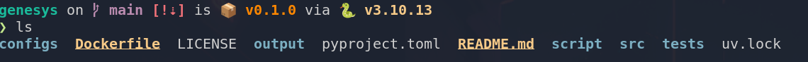
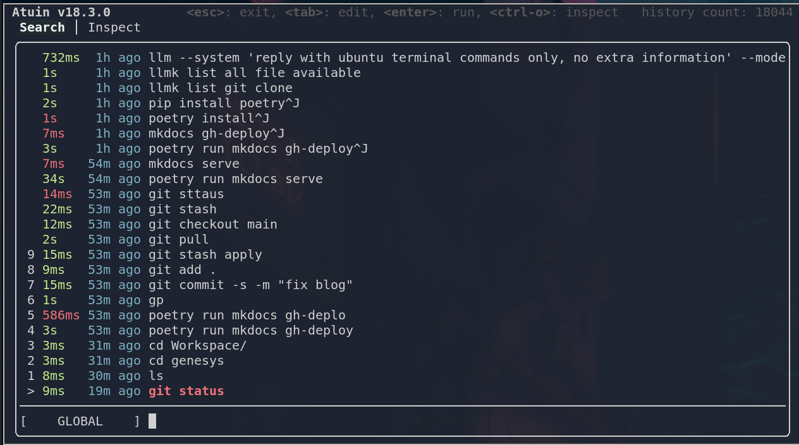
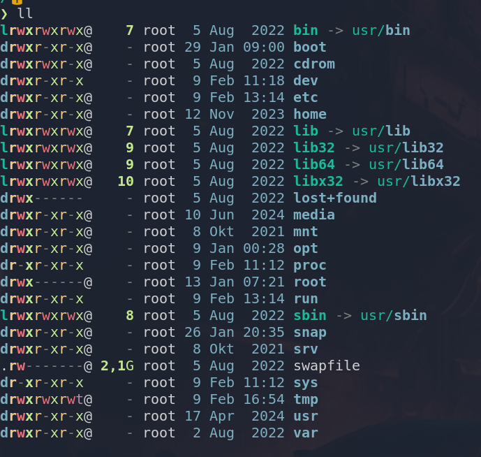

# Its time to update your terminal stack


## intro

If you still using bash without nice formatting, ls, cat, ctrl-r, ... you are ngmi. They are nice modern alternatives nowdays that make life easier.

> Are I am really ngmi if I don't have this tools ?

No, nobody care about the tool you use. They are amazing engineers working on windows doing everything with their mouse and they are people spending 80% of their time ricing their arch linux setup with fancy window manager but don't know how to code


this blog post will be a list of tool I am using to replace common bash command.

## starship

[starship](https://github.com/starship/starship) is an amazing ui tool. It just look goreous, extremly usefull, and using terminal without it feels like being naked in the street.





just look at this screenshot, so many information, my python version, my python env, the state of my git, ...

I would be blind if I had not the git info to be honest, like how do you even work with git without visually knowing which branch you are working on or if you are in a dirty state ?


## Atuin

[Atuin](https://github.com/atuinsh/atuin) is a modern replacment for searching in your command history, a.k.a ctrl-r or arrow up. 
It's beautiful, more expressive that traditionnal ctrl-k, its beautiful, it looks proffesional, it's beautiful. Ah and the real killer feature beyond being beautiful is that you can sync database between multiple machine. If you are not sold its because you don't like progress.




one caveat is atuin is that it's more verbose ans slighty slower than traditionnal history search especially when accessing via a remote machine. 

I am only using atuin with ctrl-r and use default behavior for arrow up. 

```bash
eval "$(atuin init zsh --disable-up-arrow)"
```

If you are a heavy ctrl-r using probably swap and use atuin with arrow up while keeping ctrl-r fast.

## bat
[bat](https://github.com/sharkdp/bat) is a modern replacement for cat. It mainly add syntax highlighting with color the ability to search like in vim with `/`.

Its quite customisable as well and the default option output line number, which make it hard to copy paste. I personnaly prefer to have

```bash
alias cat="bat --style=plain"
```

as my cat alias

## exa

[exa](https://github.com/ogham/exa) is a modern replacement for ls. Yeah who would have tought that a command as simple as ls could be made better ? Exa basiscally add color highlighting which seems like a
a simple feature but it is actually great.




I am defaulting to the following alias

```bash
alias ls="exa"
alias ll="exa -lal"
```


## outro 1: rust

you would have notice that most of this tool are written in rust. Does it matter ? No. It just that people write this tool in their free time and doing rust during your free time is fun.
You could do nice terminal tooling in any language. Even python.

## outro 2: AI

Terminal have been around for a LONG time. But developper tool for terminal are just getting started (at least that's my perception).
Terminal are a bit like the radio, everybody would have bet that it would have died but turns out people like it even more now (at least that's my perception).

Anyway my point is that terminal tool will be even more relevant with AI, so expect to see the next version of this blog post with a shiton of AI terminal tool. 

First relevant tool in this [blog post:](https://samsja.github.io/blogs/llm_terminal/cursoc_ctrlk_in_terminal/)


